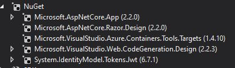

# api rest .net core 2.2 + jwt 
este proyecto es un api rest conectado a una base de datos en sql server hecho en .net core 2.2

### Pre-requisitos 📋

tener insladado Visual studio 2017 en adelate 
es necesario descargar desde NuGet los siguientes paquetes
#

   

